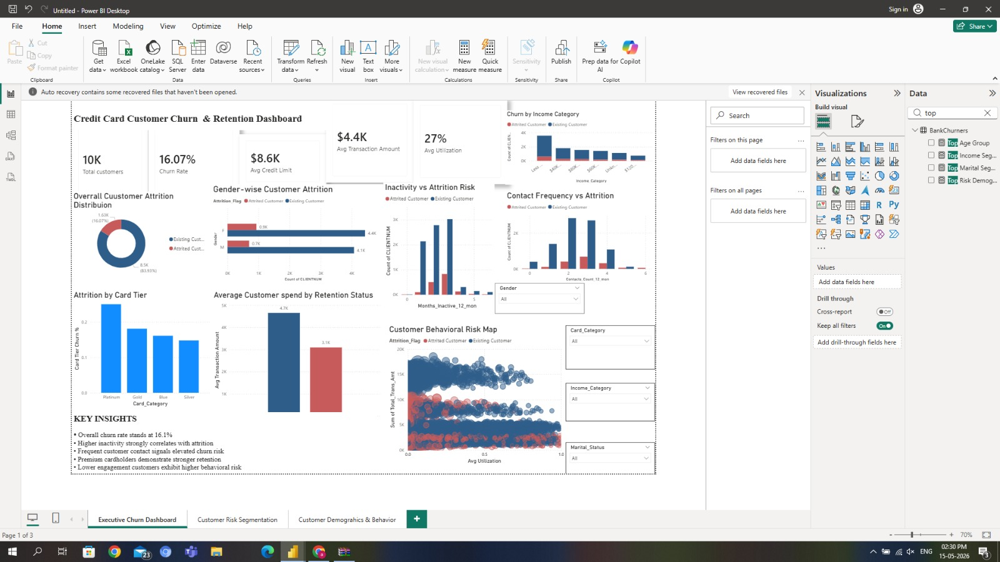
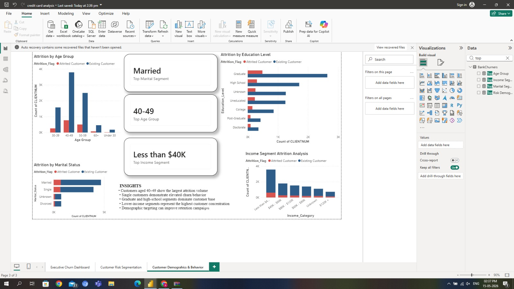
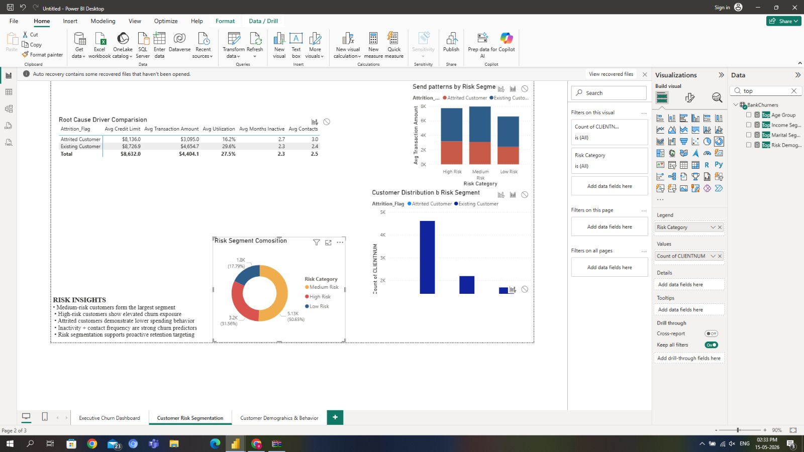
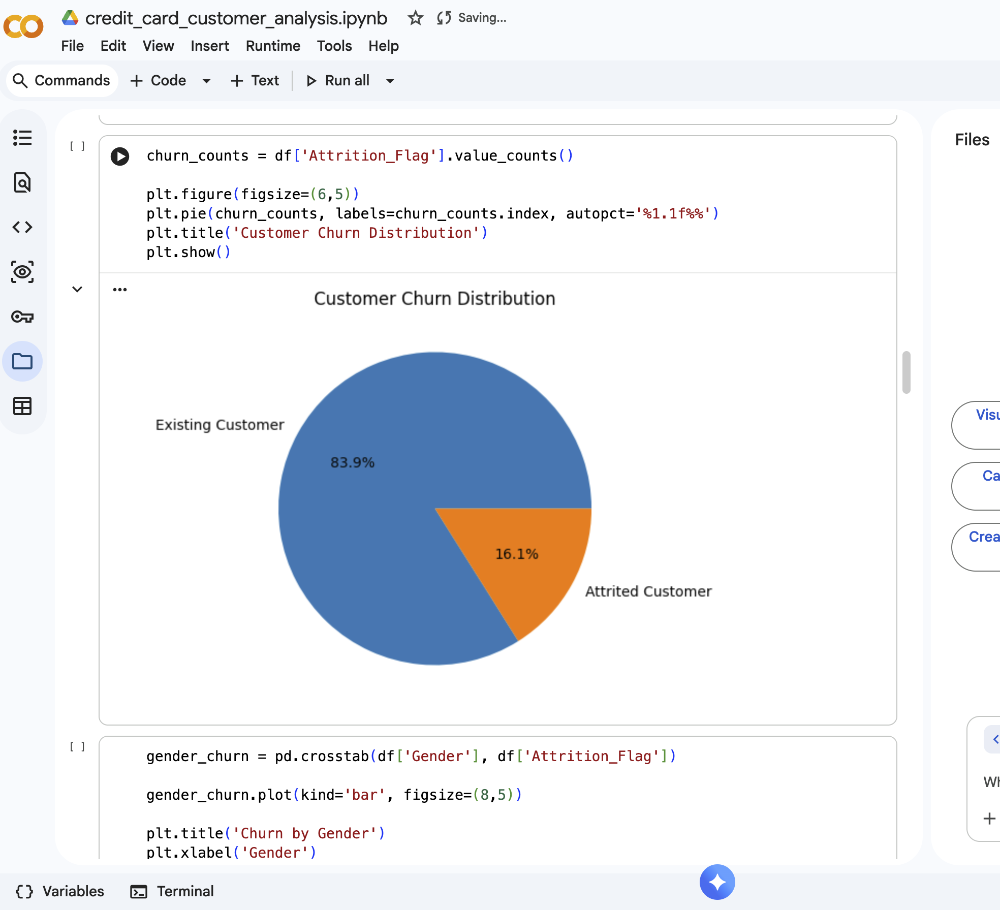
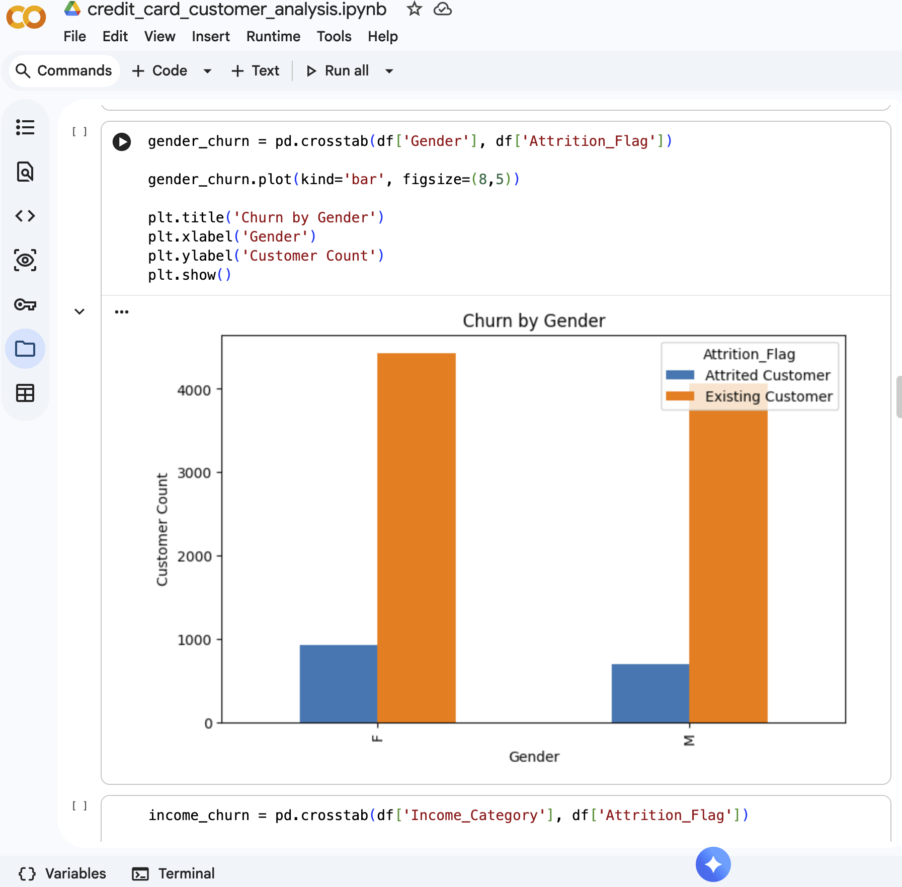
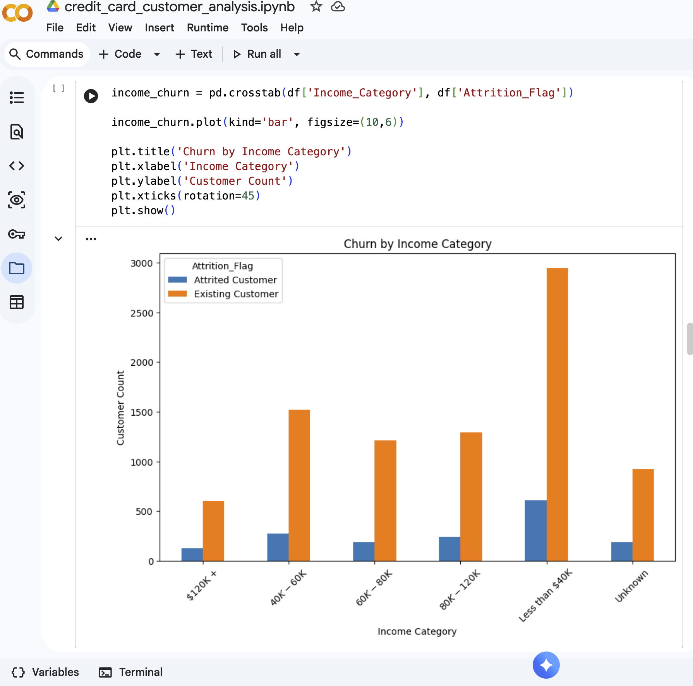
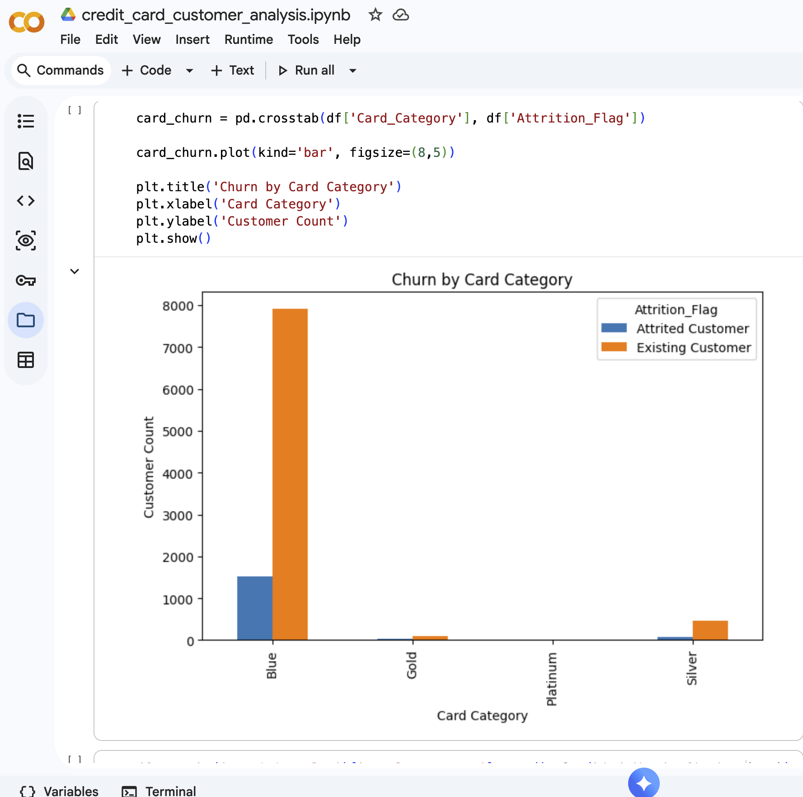
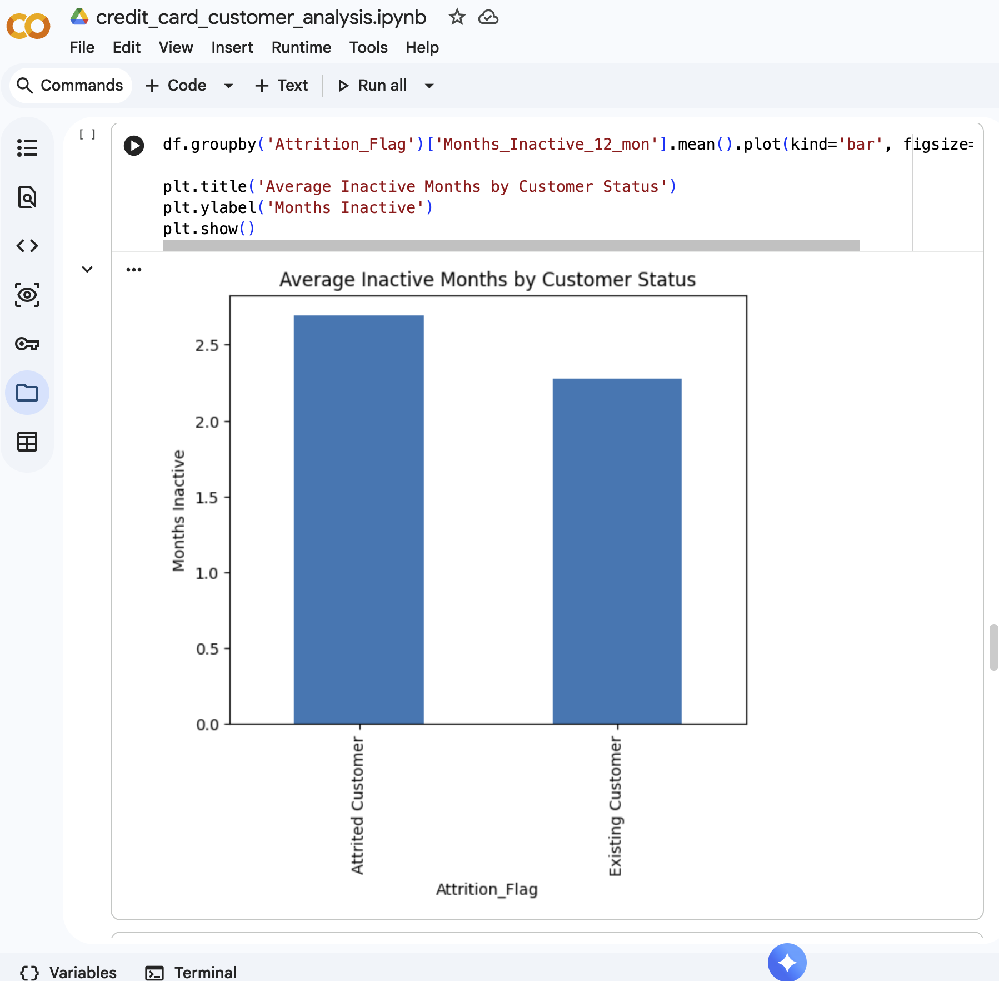
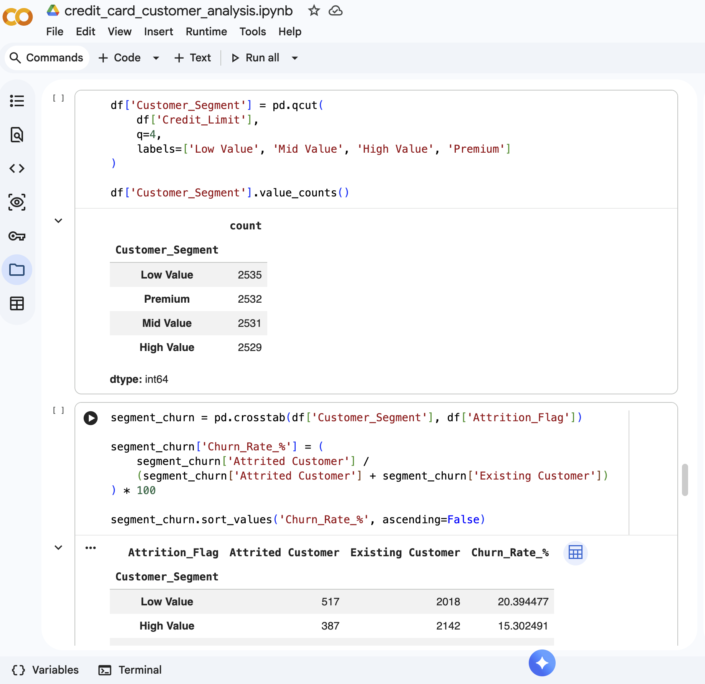
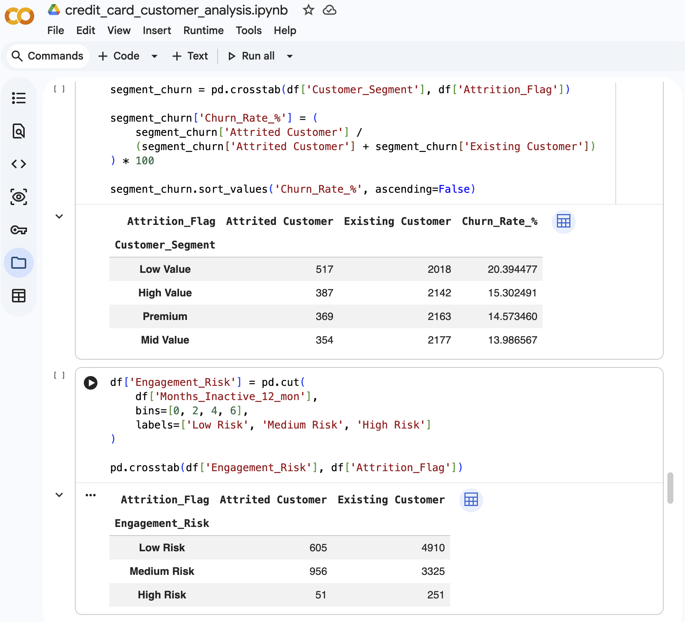

# Credit Card Customer Churn Analysis

## Project Overview
This project analyzes customer churn behavior in a credit card customer dataset to identify the factors influencing attrition and generate actionable business insights.

The analysis focuses on customer demographics, spending behaviour, engagement patterns, credit utilization, and segmentation-based churn risk.

## Business Problem
Customer churn directly impacts profitability for financial institutions.

The objective of this project is to:
- Identify key drivers of customer attrition
- Segment customers based on churn risk
- Analyze demographic and behavioural patterns
- Generate business recommendations for retention strategies

---

## Tools & Technologies
- Python
- Pandas
- NumPy
- Matplotlib
- Google Colab
- GitHub

---

## Dataset
Dataset includes customer information such as:

- Age
- Gender
- Income Category
- Card Category
- Credit Limit
- Transaction Amount
- Transaction Count
- Months Inactive
- Credit Utilization Ratio
- Customer Attrition Status

---

## Key Analysis Performed
### Exploratory Data Analysis
- Dataset validation and structure inspection
- Missing value checks
- Data type analysis

### Churn Behaviour Analysis
- Overall churn distribution
- Gender-based churn comparison
- Income-based churn analysis
- Card category churn behaviour

### Customer Segmentation
- Credit limit based customer segmentation
- Risk segmentation using inactivity behaviour
- High-value vs low-value customer churn analysis

### Correlation Analysis
- Numerical feature correlation analysis
- Behavioural trend identification

---

## Dashboard Snapshots

### Executive Dashboard


### Customer Demographics Dashboard


### Risk Segmentation Dashboard


---

## Python Analysis Visualizations

### 1. Dataset Overview & Data Validation


### 2. Customer Churn Distribution


### 3. Churn Analysis by Gender


### 4. Churn Analysis by Income Segment


### 5. Engagement Risk Segmentation


### 6. Correlation Analysis Heatmap


### 7. Customer Value Segmentation Churn Analysis


---

## Key Insights
- Overall customer churn rate is approximately 16%
- Low-value customers showed the highest churn rate
- Higher inactivity strongly correlates with attrition
- Existing customers show significantly higher transaction activity
- Income and engagement behaviour are strong churn indicators

---

## Business Recommendations
- Build retention campaigns for low-value churn-risk customers
- Introduce engagement strategies for inactive customers
- Reward high-value loyal customers
- Monitor early warning churn indicators proactively

---

## Project Structure
```bash
asset/
├── dashboard-visuals/
├── python-analysis/

README.md
credit_card_customer_analysis.ipynb
```

---

## Author
**Aruna Garnepudi**
